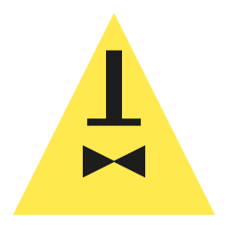

{.center}

# Bill Cipher CLI

## Descrição

O Bill Cipher CLI é um programa de linha de comando desenvolvido para realizar operações de criptografia e descriptografia de texto utilizando métodos de criptografia simples. Este projeto visa proporcionar uma ferramenta fácil de usar para segurança básica de informações, bem como servir como uma base prática para o aprendizado de diversas tecnologias e ferramentas no ecossistema Python.

### Funcionalidades Principais

- **Cifra de César**: Um método clássico de criptografia que desloca cada letra do texto uma certa quantidade de posições no alfabeto.
- **Cifra de Vigenère**: Um método mais complexo que utiliza uma palavra-chave para realizar a criptografia, tornando a descriptografia mais desafiadora sem a chave correta.

## Tecnologias Utilizadas

- **Python**: Linguagem de programação principal utilizada para o desenvolvimento do CLI.
- [**Typer**](https://typer.tiangolo.com/): Biblioteca para criação de aplicações de linha de comando amigáveis.
- [**Poetry**](https://python-poetry.org/): Ferramenta de gerenciamento de dependências e empacotamento de projetos Python.
- [**MkDocs**](https://www.mkdocs.org/): Gerador de sites estáticos para documentação de projetos.
- [**MkDocstrings**](https://mkdocstrings.github.io/): Extensão para MkDocs que permite a geração automática de documentação a partir de docstrings do código.

## Por que fiz o projeto?

Iniciei o Bill Cipher CLI para aprender e aplicar na prática o uso de diversas ferramentas e bibliotecas Python. A inspiração para este projeto veio da playlist ["Construindo um pacote Python do zero #CodaComigo"](https://www.youtube.com/playlist?list=PLOQgLBuj2-3LiHhK1upnjpHiFzcJ472QS) do [Eduardo Mendes](https://github.com/dunossauro), que serviu como uma excelente base de estudos. Através deste projeto, explorei o uso do módulo Typer para criar comandos de linha de comando, utilizei o Poetry para gerenciamento de dependências e empacotamento, e usei o MkDocs junto com o MkDocstrings para documentar o projeto de forma clara e organizada.